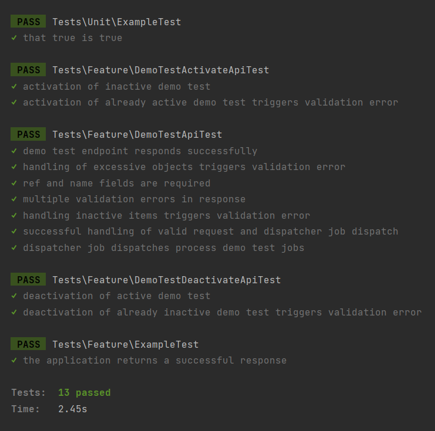

# Demo Test Project

This project is a Laravel-based API that handles the creation, activation, and deactivation of demo test items. It includes robust testing capabilities and uses a database to manage state and simulate various test conditions.

## Requirements

- PHP 8.1 or higher
- Composer
- Laravel 9
- MySQL

## Installation

Follow these steps to set up the project on your local machine:

1. **Clone the Repository**

   ```bash
   git clone https://github.com/zubayer-hossain/demo-test-project.git
   ```
   ```bash
   cd demo-test-project
    ```


2. **Install Dependencies**

   ```bash
   composer install
   ```


3. **Environment Configuration**
   Copy the example environment file and make the necessary configuration changes in the `.env` file.

   ```bash
   cp .env.example .env
   ```
   Update these settings in the `.env` file to match your local environment:
- `DB_DATABASE` (your database name)
- `DB_USERNAME` (your database username)
- `DB_PASSWORD` (your database password)

4. **Generate App Key**

   ```bash
   php artisan key:generate
   ```
   
5. **Run Migrations**

   ```bash
    php artisan migrate
    ```


6. **Running the Application**
   Start the local development server:

   ```bash
    php artisan serve
    ```
   You can now access the server at http://localhost:8000.
7. **Queue Configuration**
   Ensure that your queue driver is set up correctly in the .env file:
    ```bash
    QUEUE_CONNECTION=database
    ```
    To process jobs, you must run the queue worker:
    ```bash
    php artisan queue:work
    ```

    Remember to restart this command if you change any code related to jobs or if you want to change the environment setting SIMULATE_FAILURE.

## Testing API Endpoints

You can test the API endpoints using Postman or any other API client:

- **Create Test Data**: POST `/api/demo/test`
  Body example:
```json
[
 {
   "ref": "T-1",
   "name": "Test Item 1",
   "description": "A detailed description of Test Item 1."
 },
 {
   "ref": "T-2",
   "name": "Test Item 2",
   "description": null
 }
]
```
- **Activate Test Data**: POST `/api/demo/test/activate`
  Body example:
```json
{
    "ref": "T-1"
}
```
- **Deactivate Test Data**: POST `/api/demo/test/deactivate`
  Body example:
```json
{
    "ref": "T-1"
}
```
## Simulating Failures

To simulate job failures at a rate of approximately 10%, set the environment variable `SIMULATE_FAILURE` to `true` in your `.env` file. Adjust this as needed to test different failure scenarios.
```bash
SIMULATE_FAILURE=true
```
## Running Tests

To run the PHPUnit tests included with the project:

```bash
php artisan test
```

## Test Results

Here is a screenshot of a successful test results after running `php artisan test`:



## Error Handling in API Responses

API errors are structured in JSON format to provide clear, actionable information. Here are some error examples of `422` Unprocessable Entity responses:

```json
{
    "message": "A maximum of 2000 items are allowed."
}
```
```json
{
    "message": "Each ref must follow the format T-[number]."
}
```
```json
{
    "message": "A name is required for each item."
}
```
```json
{
    "message": "The test with the given reference ID is already active."
}
```
